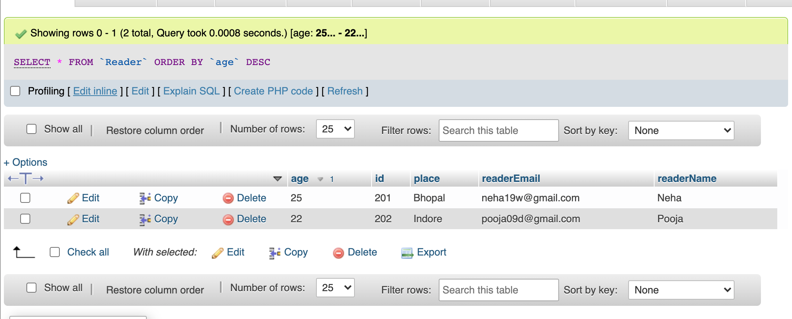
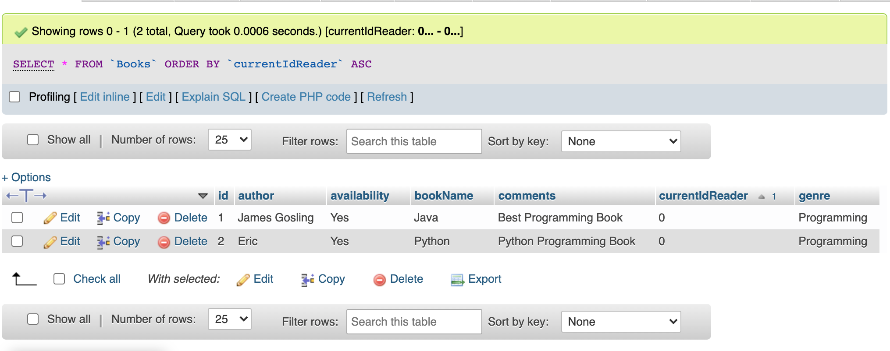
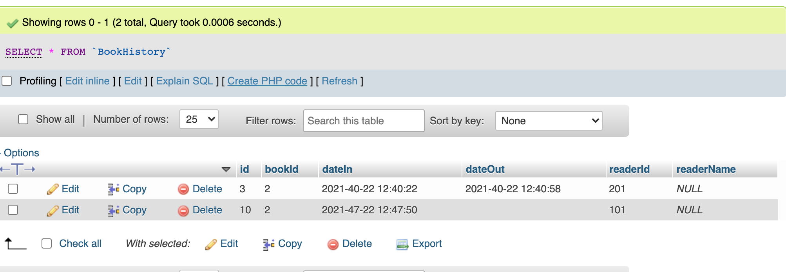
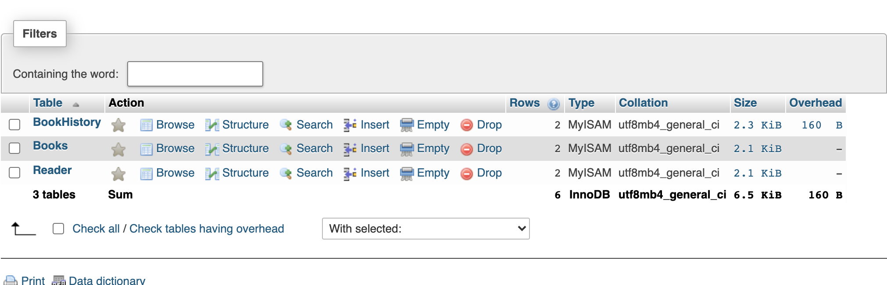
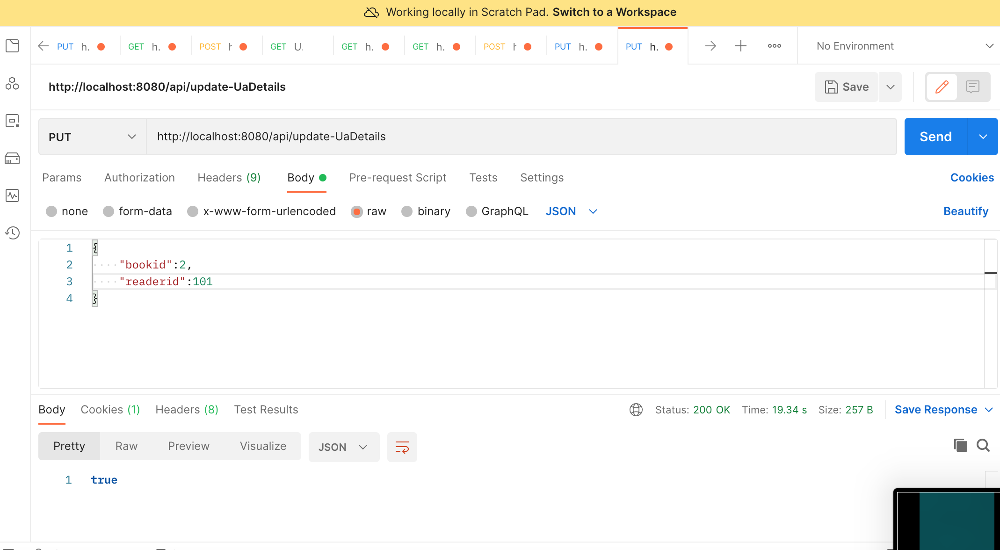
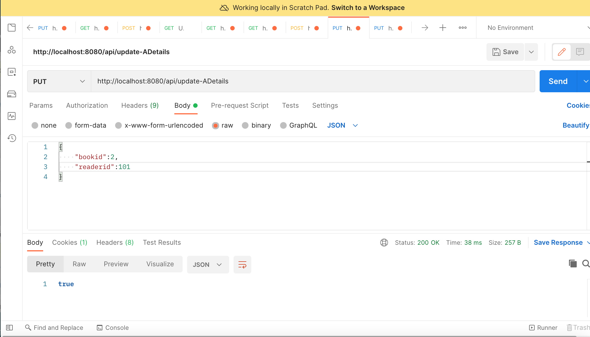
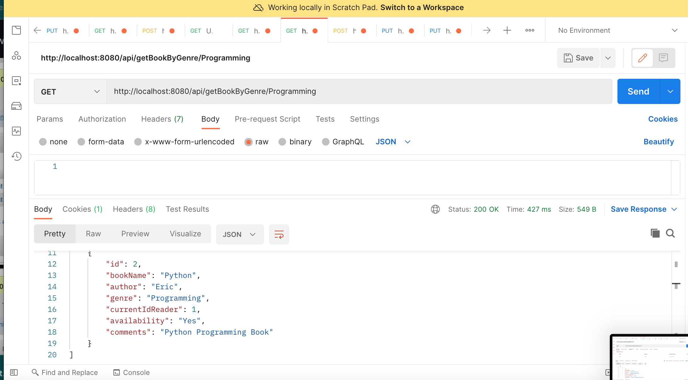
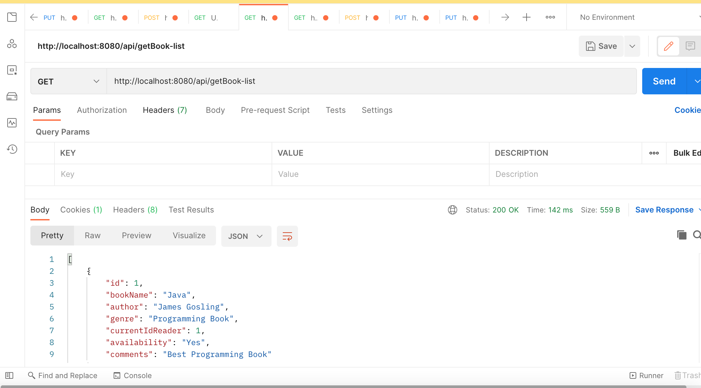

# LibraryManagementSystem
Steps -
1.Open this project on Spring Boot
2.Change the application properties
3.Import sql file and view table on phpmyadmin
4.Run api on postman

API :
1. http://localhost:8080/api/getBook-list
2. http://localhost:8080/api/getBookByGenre/Programming
3. http://localhost:8080/api/getBookByAuthor/James
4. http://localhost:8080/api/save-book
5. http://localhost:8080/api/update-ADetails
6. http://localhost:8080/api/update-UaDetails

1. This api will show the list of books available to the reader.
2. This api will show list of books by Gener.
3. This api will show list of books by Author.
4. To save new Book
5. This api will assing book to Reader.
6. This api will unassign book from Reader.

